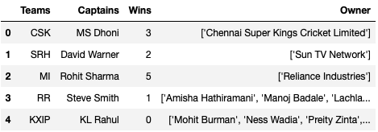
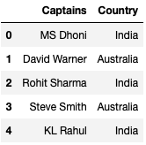
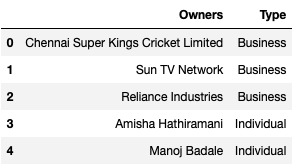
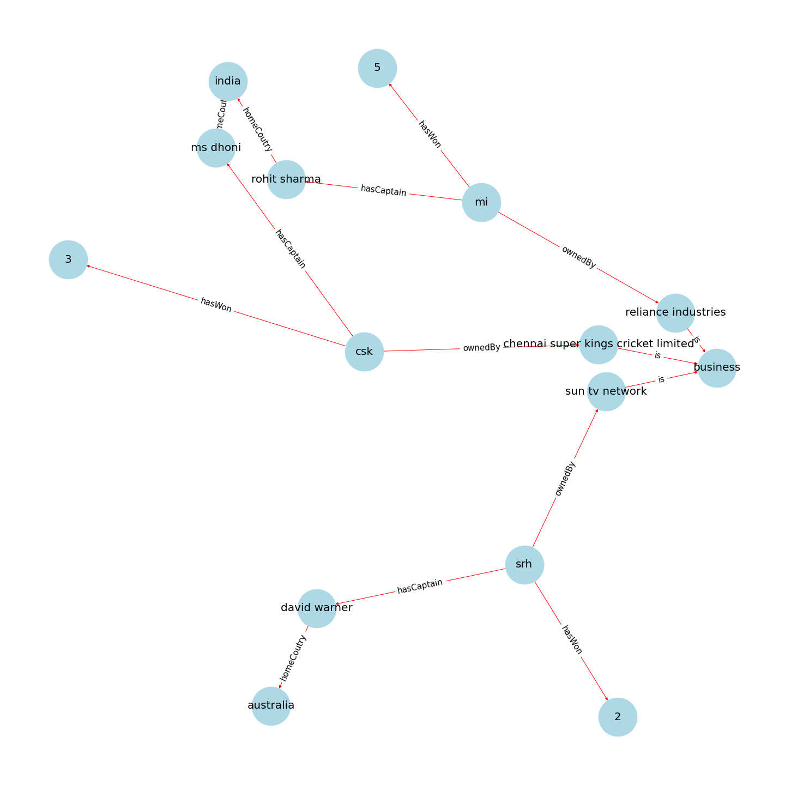
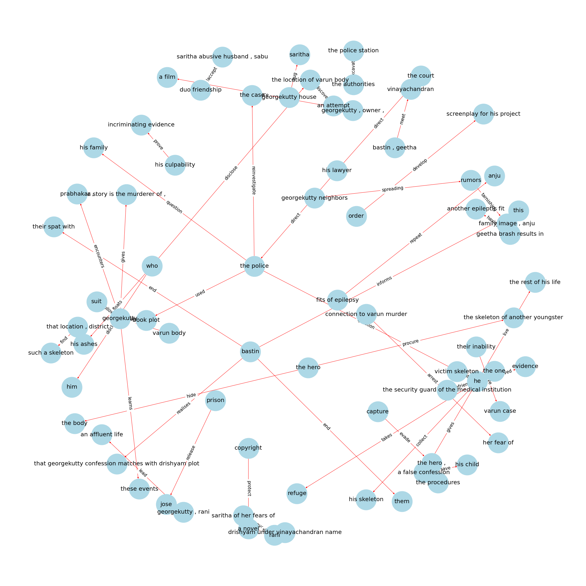

# Ontologies and Knowledge Graphs

### Ontologies:

These are semantic data models that comtain genric information about an entity, but not the specific details concerning a particular entity. For example, an ontology will have properties of humans and associted relations, but it will not have information about a particular human like you or me. This general definition of a human can be later used to define a particular human being.

Each ontology is composed of three items:
1. Classes
2. Relationships
3. Attributes

### Knowledge Graph:

Once we have an ontology, if we add specific data points, we can create a knowledge graph. Continuing with our earlier example of a semantic data model of humans, if we add a couple of specific people we can create a graph using them. Effectively, a ***knowledge graph is created using ontologies and data***.

Using the data available about the IPL teams, we can create a simple knowledge graph using ontologies. 

Example of a knowledge graph constructed on the plot of Drishyam 2. 

